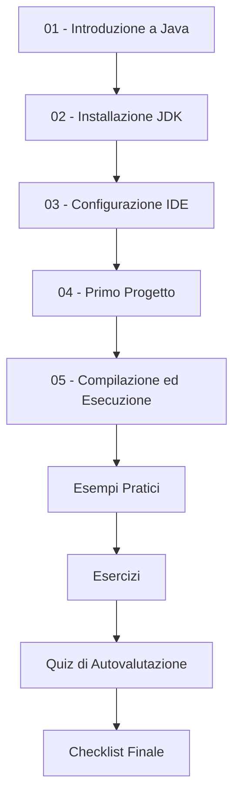

# Modulo A - Ambiente di Sviluppo ⚡

## 📋 **Informazioni del Modulo**

- **Tempo stimato:** 2-3 ore
- **Difficoltà:** Principiante
- **Prerequisiti:** Conoscenza base del computer
- **Obiettivo:** Configurare un ambiente di sviluppo Java completo e funzionante

---

## 🎯 **Obiettivi di Apprendimento**

Al termine di questo modulo, sarai in grado di:

- ✅ **Installare** correttamente Java JDK 8 o superiore
- ✅ **Configurare** le variabili d'ambiente JAVA_HOME e PATH
- ✅ **Installare e configurare** un IDE moderno (IntelliJ IDEA, Eclipse, o VS Code)
- ✅ **Creare** il tuo primo progetto Java
- ✅ **Compilare ed eseguire** il classico "Hello World"
- ✅ **Comprendere** la struttura di un progetto Java
- ✅ **Utilizzare** strumenti di base come compilatore javac e interprete java

---

## 📚 **Contenuti del Modulo**

### **Teoria** 📖
1. **[Introduzione a Java](teoria/01-introduzione-java.md)** - Storia, caratteristiche e vantaggi
2. **[Installazione JDK](teoria/02-installazione-jdk.md)** - Download e configurazione Java
3. **[Configurazione IDE](teoria/03-configurazione-ide.md)** - Setup ambiente di sviluppo
4. **[Primo Progetto](teoria/04-primo-progetto.md)** - Creazione e struttura progetto Java
5. **[Compilazione ed Esecuzione](teoria/05-compilazione-esecuzione.md)** - Ciclo di sviluppo Java

### **Esempi Pratici** 💻
- **[HelloWorld.java](esempi/HelloWorld.java)** - Il classico primo programma
- **[HelloWorldAdvanced.java](esempi/HelloWorldAdvanced.java)** - Versione commentata e documentata
- **[ProgettoEsempio.java](esempi/ProgettoEsempio.java)** - Struttura di un piccolo progetto
- **[TestInstallazione.java](esempi/TestInstallazione.java)** - Verifica installazione e configurazione

### **Esercizi** ✏️
- **[Esercizi Guidati](esercizi/README.md)** - Esercitazioni pratiche passo-passo
- **[Soluzioni Complete](esercizi/soluzioni/)** - Soluzioni dettagliate con spiegazioni

### **Quiz** 📝
- **[Quiz Modulo A](quiz/quiz-modulo-a.md)** - 10 domande di autovalutazione
- **[Soluzioni Quiz](quiz/soluzioni-quiz-a.md)** - Risposte commentate

---

## 🗂️ **Percorso di Studio Consigliato**

### **Modalità Step-by-Step:**
1. **📖 Leggi** la teoria (30-45 min)
2. **💻 Sperimenta** con gli esempi (45-60 min)  
3. **✏️ Svolgi** gli esercizi (30-45 min)
4. **📝 Completa** il quiz (15 min)
5. **✅ Verifica** la checklist finale

---

## 🛠️ **Strumenti Necessari**

### **Software da Installare:**
- **Java JDK 8+** (OpenJDK o Oracle JDK)
- **IDE a scelta:**
  - **IntelliJ IDEA Community** (Raccomandato)
  - **Eclipse IDE for Java Developers**
  - **Visual Studio Code** + Extension Pack for Java

### **Opzionali ma Consigliati:**
- **Git** per il controllo versione
- **Maven** per la gestione progetti (verrà introdotto nei moduli successivi)

---

## ⚠️ **Errori Comuni e Soluzioni**

### **Problema: "java" comando non riconosciuto**
**Causa:** PATH non configurato correttamente  
**Soluzione:** Verificare configurazione variabili d'ambiente → [Guida Troubleshooting](teoria/02-installazione-jdk.md#troubleshooting)

### **Problema: IDE non trova JDK**
**Causa:** JAVA_HOME non impostato  
**Soluzione:** Configurare JAVA_HOME correttamente → [Guida IDE](teoria/03-configurazione-ide.md)

### **Problema: Errori di compilazione HelloWorld**
**Causa:** Sintassi o nome file errato  
**Soluzione:** Verificare nome classe = nome file → [Esempi](esempi/)

---

## 📊 **Checklist di Autovalutazione**

Prima di procedere al Modulo B, assicurati di saper fare:

- [ ] Aprire terminale/prompt e verificare versione Java con `java -version`
- [ ] Compilare un file `.java` con `javac NomeFile.java`
- [ ] Eseguire un programma Java con `java NomeClasse`
- [ ] Creare un nuovo progetto nel tuo IDE
- [ ] Scrivere, compilare ed eseguire un programma "Hello World" modificato
- [ ] Spiegare la differenza tra compilazione e interpretazione in Java
- [ ] Identificare i componenti principali di un programma Java (package, class, main method)

---

## 🔗 **Risorse Aggiuntive**

- **[Oracle Java Documentation](https://docs.oracle.com/javase/)**
- **[OpenJDK Download](https://openjdk.java.net/)**
- **[IntelliJ IDEA Tutorial](https://www.jetbrains.com/help/idea/)**
- **[Eclipse IDE Tutorial](https://www.eclipse.org/getting_started/)**

---

## 🚀 **Navigazione del Corso**

- **[📑 Indice Principale](../README.md)**
- **[⬅️ Torna all'Indice](../README.md)**
- **[➡️ Modulo B - Problemi ed Algoritmi](../B-Problemi_ed_algoritmi/README.md)**

---

## 📈 **Prossimi Passi**

Una volta completato questo modulo:
1. **Verifica** la tua preparazione con la checklist
2. **Completa** il quiz per consolidare le conoscenze
3. **Passa** al [Modulo B](../B-Problemi_ed_algoritmi/README.md) per imparare problem solving e algoritmi

---

*💡 **Suggerimento:** Non avere fretta! Un ambiente di sviluppo ben configurato ti farà risparmiare molto tempo nei moduli successivi.*
