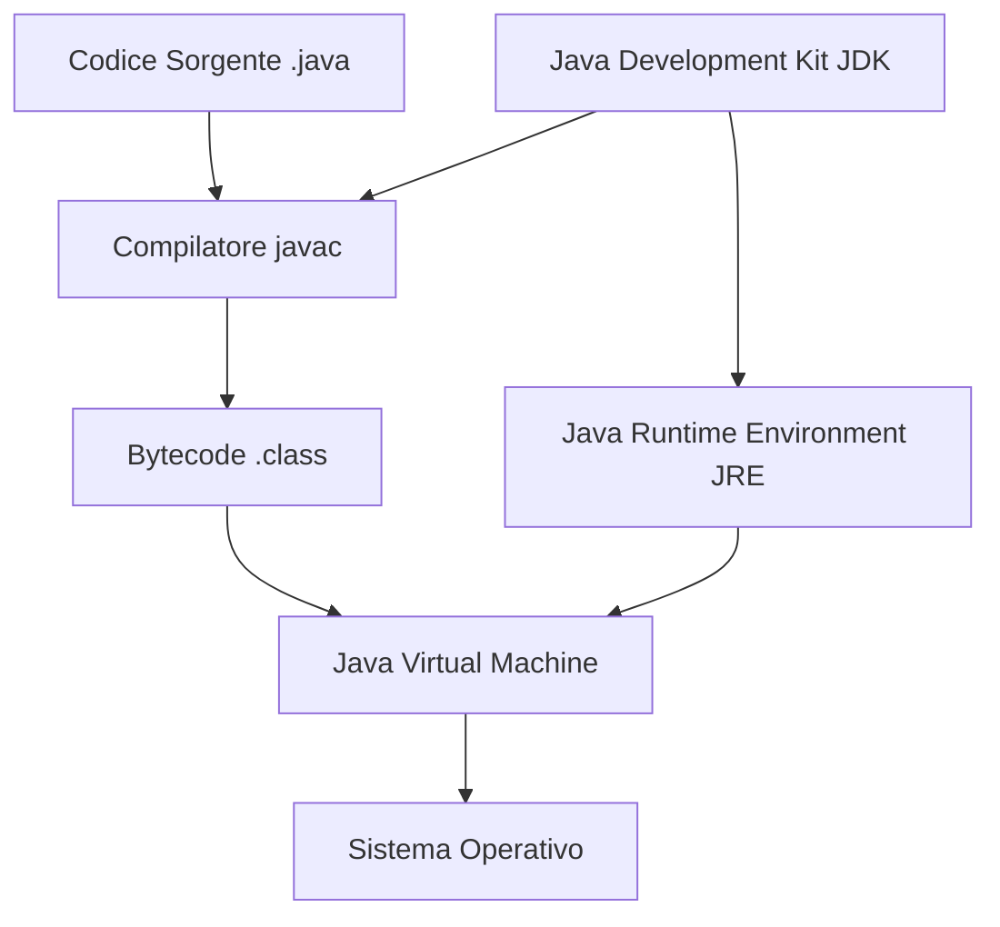

# Introduzione a Java

## 📚 **Cos'è Java?**

Java è un linguaggio di programmazione **orientato agli oggetti**, **multipiattaforma** e **fortemente tipizzato**, sviluppato da Sun Microsystems (ora Oracle) nel 1995. È uno dei linguaggi più popolari al mondo per lo sviluppo di applicazioni enterprise, web, mobile e desktop.

---

## 🎯 **Caratteristiche Principali di Java**

### **1. "Write Once, Run Anywhere" (WORA)**
```
Codice Java (.java) → Compilatore javac → Bytecode (.class) → JVM → Esecuzione
```
- Il codice Java viene compilato in **bytecode** indipendente dalla piattaforma
- Il bytecode viene eseguito dalla **Java Virtual Machine (JVM)**
- Lo stesso programma funziona su Windows, macOS, Linux senza modifiche

### **2. Orientato agli Oggetti**
- Tutto in Java è un **oggetto** (tranne i tipi primitivi)
- Supporta **incapsulamento**, **ereditarietà** e **polimorfismo**
- Promuove la **riusabilità** e **modularità** del codice

### **3. Gestione Automatica della Memoria**
- **Garbage Collection** automatico
- Nessun bisogno di gestire manualmente `malloc()` e `free()`
- Riduce significativamente i **memory leak**

### **4. Robusto e Sicuro**
- **Controllo rigoroso dei tipi** a compile-time
- **Gestione delle eccezioni** integrata
- **Security Manager** per applicazioni web e distribuite
- Nessun uso diretto di puntatori

### **5. Multithreading Nativo**
- Supporto integrato per la **programmazione concorrente**
- API ricche per gestire **thread** e **sincronizzazione**

---

## 🏗️ **Architettura Java**

### **Componenti Principali:**



#### **JDK (Java Development Kit)**
- **Ambiente completo** per sviluppare applicazioni Java
- Include: compilatore (`javac`), debugger (`jdb`), documentazione (`javadoc`)
- **Necessario** per sviluppare applicazioni Java

#### **JRE (Java Runtime Environment)**
- **Ambiente di esecuzione** per applicazioni Java
- Include: JVM, librerie standard, plugin browser
- **Sufficiente** per eseguire applicazioni Java già compilate

#### **JVM (Java Virtual Machine)**
- **Macchina virtuale** che esegue il bytecode Java
- Specifica per ogni piattaforma (Windows JVM, Linux JVM, etc.)
- Gestisce memoria, garbage collection, ottimizzazioni

---

## 📈 **Storia e Evoluzione**

| Versione | Anno | Novità Principali |
|----------|------|-------------------|
| **Java 1.0** | 1996 | Versione iniziale |
| **Java 1.2** | 1998 | Swing GUI, Collections Framework |
| **Java 5** | 2004 | Generics, Annotations, Autoboxing |
| **Java 8** | 2014 | Lambda expressions, Stream API |
| **Java 11** | 2018 | LTS, Moduli, var keyword |
| **Java 17** | 2021 | LTS corrente, Records, Pattern Matching |
| **Java 21** | 2023 | LTS più recente, Virtual Threads |

> **💡 Nota:** Useremo Java 8+ in questo corso, concentrandoci su funzionalità stabili e ampiamente supportate.

---

## 🌍 **Dove viene usato Java?**

### **Applicazioni Enterprise**
- **Backend** di grandi sistemi aziendali
- **Web services** e API REST
- **Microservizi** con Spring Boot

### **Applicazioni Web**
- **Server-side** con Spring, Struts
- **Application server** (Tomcat, WildFly)

### **Applicazioni Mobile**
- **Android** (linguaggio principale fino a Kotlin)
- **Cross-platform** con frameworks hybrid

### **Applicazioni Desktop**
- **Swing** e **JavaFX** per GUI native
- **IDE** come IntelliJ IDEA, Eclipse, NetBeans

### **Big Data e Distributed Systems**
- **Apache Kafka**, **Apache Spark**
- **Elasticsearch**, **Apache Cassandra**
- **Hadoop** ecosystem

---

## ⚖️ **Java vs Altri Linguaggi**

| Aspetto | Java | Python | C++ | JavaScript |
|---------|------|--------|-----|------------|
| **Tipizzazione** | Statica, forte | Dinamica | Statica | Dinamica |
| **Gestione Memoria** | Automatica (GC) | Automatica | Manuale | Automatica |
| **Velocità** | Veloce | Lenta | Molto veloce | Media |
| **Curva Apprendimento** | Media | Facile | Difficile | Facile |
| **Portabilità** | Eccellente | Buona | Limitata | Eccellente |
| **Ecosistema** | Maturo, vasto | Vasto | Maturo | Vastissimo |

---

## 🚀 **Vantaggi di Imparare Java**

### **Per Principianti:**
- **Sintassi chiara** e verbosa (facile da leggere)
- **Forte tipizzazione** aiuta a evitare errori
- **Vasta documentazione** e comunità
- **Molti tutorial** e risorse di apprendimento

### **Per il Mercato del Lavoro:**
- **Sempre nella top 3** dei linguaggi più richiesti
- **Stipendi competitivi** per sviluppatori Java
- **Molte opportunità** in diversi settori
- **Competenze trasferibili** ad altri linguaggi OOP

### **Per lo Sviluppo:**
- **Ecosystem maturo** con librerie per tutto
- **IDE eccellenti** (IntelliJ IDEA, Eclipse)
- **Strumenti di build** avanzati (Maven, Gradle)
- **Framework potenti** (Spring, Hibernate)

---

## ⚠️ **Svantaggi da Considerare**

### **Verbosità**
```java
// Java (verboso)
public class HelloWorld {
    public static void main(String[] args) {
        System.out.println("Hello World");
    }
}
```

```python
# Python (conciso)
print("Hello World")
```

### **Lentezza di Startup**
- La JVM ha un **overhead iniziale**
- Non ideale per **script rapidi** o **automazione semplice**

### **Gestione della Memoria**
- Nonostante il GC, possibili **memory leak** con riferimenti circolari
- **Controllo limitato** sulla gestione memoria rispetto a C/C++

---

## 🎓 **Filosofia di Design Java**

### **Principi Fondamentali:**

1. **Semplicità**: Più semplice di C++, elimina feature pericolose
2. **Robustezza**: Controlli a compile-time e runtime
3. **Sicurezza**: Ambiente sandbox per applicazioni distribuite
4. **Portabilità**: "Write once, run anywhere"
5. **Performance**: Ottimizzazioni JVM competitive con linguaggi nativi
6. **Multithreading**: Supporto nativo per programmazione concorrente

---

## 📝 **Concetti da Ricordare**

### **✅ Punti Chiave:**
- Java è **compilato** in bytecode e **interpretato** dalla JVM
- La JVM fornisce **portabilità** tra diverse piattaforme
- Java è **fortemente tipizzato** e **orientato agli oggetti**
- Il **Garbage Collection** gestisce automaticamente la memoria
- Java è ideale per **applicazioni enterprise** e **sistemi distribuiti**

### **🎯 Prossimi Passi:**
- Nel prossimo capitolo installeremo e configureremo Java
- Imparerai a usare gli strumenti `javac` e `java`
- Creerai il tuo primo programma Java funzionante

---

## 🔗 **Risorse per Approfondire**

- **[Oracle Java Documentation](https://docs.oracle.com/javase/)**
- **[Java Language Specification](https://docs.oracle.com/javase/specs/)**
- **[Java Platform History](https://en.wikipedia.org/wiki/Java_version_history)**
- **[Why Java is Popular](https://www.oracle.com/java/technologies/why-java.html)**

---

## 🚀 **Navigazione**

- **[⬅️ Torna al Modulo A](../README.md)**
- **[➡️ Prossimo: Installazione JDK](02-installazione-jdk.md)**
