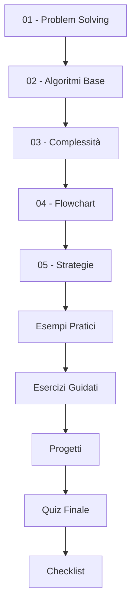

# Modulo B - Problemi ed Algoritmi 🧩

## 📋 **Informazioni del Modulo**

- **Tempo stimato:** 4-5 ore
- **Difficoltà:** Principiante-Intermedio
- **Prerequisiti:** Completamento Modulo A
- **Obiettivo:** Imparare l'approccio metodico alla risoluzione di problemi e ai concetti algoritmici fondamentali

---

## 🎯 **Obiettivi di Apprendimento**

Al termine di questo modulo, sarai in grado di:

- ✅ **Analizzare** un problema e scomporlo in sottoproblemi
- ✅ **Progettare** algoritmi per risolvere problemi specifici
- ✅ **Comprendere** la notazione Big O e la complessità computazionale
- ✅ **Utilizzare** flowchart e pseudocodice per pianificare soluzioni
- ✅ **Implementare** algoritmi fondamentali in Java
- ✅ **Valutare** l'efficienza di diverse soluzioni
- ✅ **Applicare** strategie di problem-solving sistematiche

---

## 📚 **Contenuti del Modulo**

### **Teoria** 📖
1. **[Problem Solving Metodico](teoria/01-problem-solving.md)** - Approccio sistematico ai problemi
2. **[Algoritmi Fondamentali](teoria/02-algoritmi-base.md)** - Ricerca, ordinamento, calcoli
3. **[Complessità Computazionale](teoria/03-complessita.md)** - Big O, efficienza, ottimizzazione
4. **[Flowchart e Pseudocodice](teoria/04-diagrammi-flusso.md)** - Strumenti di progettazione
5. **[Strategie Algoritmiche](teoria/05-strategie-algoritmi.md)** - Divide et impera, greedy, bruteforce

### **Esempi Pratici** 💻
- **[AlgoritmiRicerca.java](esempi/AlgoritmiRicerca.java)** - Algoritmi di ricerca lineare e binaria
- **[AlgoritmiOrdinamento.java](esempi/AlgoritmiOrdinamento.java)** - Bubble sort, selection sort, insertion sort
- **[AnalisiComplessita.java](esempi/AnalisiComplessita.java)** - Confronto prestazioni algoritmi

### **Esercizi** ✏️
- **[Esercizio 1: Secondo Massimo](esercizi/Esercizio01_SecondoMassimo.java)** - Problem solving metodico
- **[Esercizio 2: Algoritmi Ordinamento](esercizi/Esercizio02_AlgoritmiOrdinamento.java)** - Implementazione e confronto algoritmi
- **[Soluzioni Complete](esercizi/soluzioni/)** - Soluzioni commentate step-by-step

### **Quiz** 📝
- **[Quiz Modulo B](quiz/Quiz_ModuloB.md)** - 20 domande su algoritmi e problem solving

### **Progetti** 🎯
- **[Progetto: Sistema Gestione Studenti](progetti/ProgettoGestioneStudenti.java)** - Applicazione completa con algoritmi
- **[Progetto: Analizzatore Password](progetti/analizzatore-password/)** - Validazione e sicurezza

---

## 🗂️ **Percorso di Studio Consigliato**



### **Modalità Step-by-Step:**
1. **📖 Studia** la teoria (60-90 min)
2. **🔍 Analizza** gli esempi pratici (45-60 min)
3. **💻 Risolvi** gli esercizi (90-120 min)
4. **🎯 Completa** un progetto a scelta (60-90 min)
5. **📝 Completa** il quiz (20 min)
6. **✅ Verifica** la checklist finale

---

## 🛠️ **Strumenti e Metodologie**

### **Per l'Analisi:**
- **Diagrammi di flusso** (Flowchart)
- **Pseudocodice** strutturato
- **Analisi input/output**
- **Decomposizione problemi**

### **Per l'Implementazione:**
- **IDE Java** configurato
- **Debugger** per tracciare l'esecuzione
- **Carta e penna** per schemi e calcoli

### **Per la Valutazione:**
- **Test con diversi input**
- **Misurazione tempi di esecuzione**
- **Analisi della complessità**

---

## 🧠 **Concetti Chiave del Modulo**

### **1. Problem Solving Sistematico**
```
Problema → Analisi → Progettazione → Implementazione → Test → Ottimizzazione
```

### **2. Complessità Algoritmica**
- **O(1)** - Tempo costante
- **O(log n)** - Logaritmico  
- **O(n)** - Lineare
- **O(n²)** - Quadratico

### **3. Algoritmi Fondamentali**
- **Ricerca:** Lineare, Binaria
- **Ordinamento:** Bubble, Selection, Insertion
- **Matematici:** Fattoriale, Fibonacci, Numeri primi

---

## 💡 **Strategie di Risoluzione**

### **1. Divide et Impera**
Scomponi il problema in sottoproblemi più piccoli

### **2. Forza Bruta** 
Prova tutte le soluzioni possibili

### **3. Greedy**
Scegli sempre la migliore opzione locale

### **4. Pattern Recognition**
Riconosci schemi ricorrenti nei problemi

---

## ⚠️ **Errori Comuni da Evitare**

### **Errore 1: Iniziare subito a programmare**
**❌ Male:** Aprire IDE e iniziare a scrivere codice  
**✅ Bene:** Analizzare, progettare, poi implementare

### **Errore 2: Non testare con casi limite**
**❌ Male:** Testare solo con input "normali"  
**✅ Bene:** Testare con valori limite, negativi, zero

### **Errore 3: Ignorare la complessità**
**❌ Male:** "Se funziona, va bene"  
**✅ Bene:** Considerare efficienza e scalabilità

### **Errore 4: Non documentare il ragionamento**
**❌ Male:** Codice senza commenti sul "perché"  
**✅ Bene:** Spiegare la logica e le scelte algoritmiche

---

## 📊 **Checklist di Autovalutazione**

Prima di procedere al Modulo C, assicurati di saper:

### **Problem Solving** 🧩
- [ ] Scomporre un problema complesso in sottoproblemi
- [ ] Identificare input, output e vincoli di un problema
- [ ] Creare un flowchart per rappresentare un algoritmo
- [ ] Scrivere pseudocodice prima di implementare

### **Algoritmi Base** ⚙️
- [ ] Implementare una ricerca lineare in un array
- [ ] Implementare una ricerca binaria (su array ordinato)
- [ ] Implementare un algoritmo di ordinamento semplice
- [ ] Calcolare fattoriale e Fibonacci con iterazione e ricorsione

### **Complessità** 📈
- [ ] Riconoscere la complessità O(1), O(n), O(n²) in codice semplice
- [ ] Confrontare l'efficienza di algoritmi diversi
- [ ] Spiegare perché un algoritmo è più efficiente di un altro

### **Implementazione** 💻
- [ ] Validare input dell'utente
- [ ] Gestire casi particolari (array vuoti, valori limite)
- [ ] Scrivere codice leggibile e ben commentato
- [ ] Testare algoritmi con diversi input

---

## 🎮 **Progetti Pratici**

### **Progetto 1: Gioco "Indovina il Numero"** 🎲
- Implementa strategie di ricerca
- Gestisci input utente
- Analizza statistiche di gioco

### **Progetto 2: Analizzatore di Password** 🔐
- Valuta forza password
- Implementa controlli di sicurezza
- Genera statistiche dettagliate

---

## 🔗 **Risorse Aggiuntive**

- **[Visualizzazione Algoritmi](https://visualgo.net/)** - Animazioni interattive
- **[Big O Cheat Sheet](https://www.bigocheatsheet.com/)** - Riferimento rapido complessità
- **[Algorithm Visualizer](https://algorithm-visualizer.org/)** - Strumento di visualizzazione
- **[Pseudocode Guidelines](https://en.wikipedia.org/wiki/Pseudocode)** - Standard pseudocodice

---

## 🚀 **Navigazione del Corso**

- **[📑 Indice Principale](../README.md)**
- **[⬅️ Modulo A - Ambiente di Sviluppo](../A-Ambiente_di_sviluppo/README.md)**
- **[➡️ Modulo C - Dati, Assegnazione e I/O](../C-Dati_assegnazione_IO/README.md)**

---

## 📈 **Progressione della Difficoltà**

```
Livello 1: Problemi semplici (1 step)
    ↓
Livello 2: Problemi composti (2-3 steps)  
    ↓
Livello 3: Problemi con cicli semplici
    ↓
Livello 4: Problemi con cicli annidati
    ↓
Livello 5: Problemi ricorsivi base
```

---

*💡 **Ricorda:** Gli algoritmi sono ricette per risolvere problemi. Come in cucina, più pratichi, più diventi bravo!*
