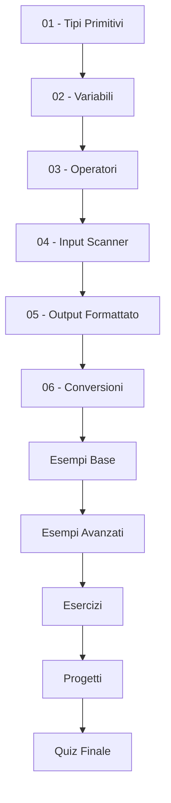

# Modulo C - Dati, Assegnazione e I/O 📊

## 📋 **Informazioni del Modulo**

- **Tempo stimato:** 6-8 ore
- **Difficoltà:** Principiante-Intermedio
- **Prerequisiti:** Completamento Moduli A e B
- **Obiettivo:** Padroneggiare tipi di dati, variabili, operatori e input/output in Java

---

## 🎯 **Obiettivi di Apprendimento**

Al termine di questo modulo, sarai in grado di:

- ✅ **Utilizzare** tutti i tipi di dati primitivi Java
- ✅ **Dichiarare e inizializzare** variabili e costanti
- ✅ **Applicare** operatori aritmetici, logici e di confronto
- ✅ **Gestire** input dell'utente con Scanner
- ✅ **Formattare** output con System.out e printf
- ✅ **Convertire** tra diversi tipi di dati
- ✅ **Validare** input utente e gestire errori comuni
- ✅ **Creare** programmi interattivi completi

---

## 📚 **Contenuti del Modulo**

### **Teoria** 📖
1. **[Tipi di Dati Primitivi](teoria/01-tipi-dati-primitivi.md)** - int, double, boolean, char
2. **[Variabili e Costanti](teoria/02-variabili-costanti.md)** - Dichiarazione, inizializzazione, scope
3. **[Operatori e Espressioni](teoria/03-operatori-espressioni.md)** - Aritmetici, logici, confronto
4. **[Input con Scanner](teoria/04-input-scanner.md)** - Lettura dati utente, validazione
5. **[Output Formattato](teoria/05-output-formattato.md)** - printf, formatting, best practices
6. **[Conversioni di Tipo](teoria/06-conversioni-tipo.md)** - Casting, parsing, wrapper classes

### **Esempi Pratici** 💻
- **[TipiDatiDemo.java](esempi/TipiDatiDemo.java)** - Tutti i tipi primitivi con esempi
- **[CalcolatoreInterattivo.java](esempi/CalcolatoreInterattivo.java)** - I/O e operazioni matematiche
- **[ConvertereTipi.java](esempi/ConvertereTipi.java)** - Casting e conversioni
- **[ValidatoreInput.java](esempi/ValidatoreInput.java)** - Validazione robusta dell'input
- **[FormattazioneOutput.java](esempi/FormattazioneOutput.java)** - Tecniche di formattazione avanzate

### **Esercizi** ✏️
1. **[Esercizio 1 - Calcolatrice Scientifica](esercizi/Esercizio01_CalcolatriceScientifica.java)** 
   - Dimostra tutti i tipi di dati primitivi e operatori
   - [➡️ Soluzione](esercizi/soluzioni/Esercizio01_CalcolatriceScientifica_Soluzione.java)

2. **[Esercizio 2 - Sistema Gestione Magazzino](esercizi/Esercizio02_GestioneMagazzino.java)**
   - Input/Output avanzato, formattazione, validazione
   - [➡️ Soluzione](esercizi/soluzioni/Esercizio02_GestioneMagazzino_Soluzione.java)

### **Quiz** 📝
- **[Quiz Modulo C](quiz/Quiz_ModuloC.md)** - 20 domande su dati, operatori e I/O
- Include: tipi primitivi, operatori, casting, Scanner, formattazione

### **Progetto Finale** 🚀
- **[Sistema Gestione Budget Personale](progetti/ProgettoGestioneBudget.java)**
- Progetto completo che integra tutti i concetti del modulo
- Tempo stimato: 4-6 ore | Valutazione: 40 punti totali

### **Progetti** 🎯
- **[Progetto: Calcolatrice Scientifica](progetti/calcolatrice-scientifica/)** - App completa con GUI testuale
- **[Progetto: Convertitore Unità](progetti/convertitore-unita/)** - Sistema di conversioni multiple

---

## 🗂️ **Percorso di Studio Consigliato**



### **Modalità Pratica Intensiva:**
1. **📖 Teoria base** (45 min) - Tipi, variabili, operatori
2. **💻 Primi esempi** (30 min) - TipiDatiDemo, semplici operazioni
3. **📖 Teoria I/O** (30 min) - Scanner e output
4. **💻 Esempi I/O** (45 min) - CalcolatoreInterattivo, validazione
5. **✏️ Esercizi graduali** (120 min) - Da semplici a complessi
6. **🎯 Progetto pratico** (90 min) - Applicazione completa
7. **📝 Quiz e review** (30 min)

---

## 🛠️ **Concetti Chiave del Modulo**

### **1. Gerarchia Tipi Primitivi**
```java
byte (8 bit) → short (16 bit) → int (32 bit) → long (64 bit)
float (32 bit) → double (64 bit)
char (16 bit Unicode)
boolean (true/false)
```

### **2. Pattern di Input Sicuro**
```java
Scanner scanner = new Scanner(System.in);
while (!scanner.hasNextInt()) {
    System.out.println("Errore! Inserisci un numero:");
    scanner.nextLine(); // Pulisce input errato
}
int numero = scanner.nextInt();
```

### **3. Formattazione Output Professionale**
```java
System.out.printf("Nome: %-15s | Età: %3d | Stipendio: %8.2f€%n", 
                  nome, eta, stipendio);
```

---

## 📊 **Tabelle di Riferimento Rapido**

### **Tipi Primitivi**
| Tipo | Dimensione | Range | Default | Esempio |
|------|------------|-------|---------|---------|
| `byte` | 8 bit | -128 a 127 | 0 | `byte b = 100;` |
| `short` | 16 bit | -32,768 a 32,767 | 0 | `short s = 1000;` |
| `int` | 32 bit | -2³¹ a 2³¹-1 | 0 | `int i = 42;` |
| `long` | 64 bit | -2⁶³ a 2⁶³-1 | 0L | `long l = 1000L;` |
| `float` | 32 bit | IEEE 754 | 0.0f | `float f = 3.14f;` |
| `double` | 64 bit | IEEE 754 | 0.0 | `double d = 3.14159;` |
| `char` | 16 bit | 0 a 65,535 | '\u0000' | `char c = 'A';` |
| `boolean` | 1 bit | true/false | false | `boolean b = true;` |

### **Operatori per Precedenza**
| Precedenza | Operatori | Associatività |
|------------|-----------|---------------|
| 1 | `()` `[]` `.` | Sinistra → Destra |
| 2 | `++` `--` `!` `~` | Destra → Sinistra |
| 3 | `*` `/` `%` | Sinistra → Destra |
| 4 | `+` `-` | Sinistra → Destra |
| 5 | `<` `<=` `>` `>=` | Sinistra → Destra |
| 6 | `==` `!=` | Sinistra → Destra |
| 7 | `&&` | Sinistra → Destra |
| 8 | `\|\|` | Sinistra → Destra |
| 9 | `=` `+=` `-=` etc. | Destra → Sinistra |

---

## ⚠️ **Errori Comuni e Soluzioni**

### **Errore 1: Overflow silenzioso**
```java
// ❌ Problema
int grande = 2000000000;
int risultato = grande + grande; // Overflow!

// ✅ Soluzione
long grande = 2000000000L;
long risultato = grande + grande; // OK
```

### **Errore 2: Divisione intera inaspettata**
```java
// ❌ Problema
int a = 5, b = 2;
double risultato = a / b; // Risultato: 2.0 (non 2.5!)

// ✅ Soluzione
double risultato = (double) a / b; // Risultato: 2.5
```

### **Errore 3: Scanner non consumato**
```java
// ❌ Problema
int numero = scanner.nextInt();
String testo = scanner.nextLine(); // Legge stringa vuota!

// ✅ Soluzione
int numero = scanner.nextInt();
scanner.nextLine(); // Consuma newline residuo
String testo = scanner.nextLine(); // Ora funziona
```

### **Errore 4: Confronto stringhe con ==**
```java
// ❌ Problema
String a = "hello";
String b = "hello";
if (a == b) // Può essere false!

// ✅ Soluzione
if (a.equals(b)) // Sempre corretto
```

---

## 💡 **Best Practices del Modulo**

### **1. Naming Conventions**
```java
// ✅ Buone pratiche
final double PI = 3.14159;           // Costanti: MAIUSCOLO
int numeroProdotti = 0;              // Variabili: camelCase
boolean isValidInput = true;         // Boolean: is/has/can prefix
```

### **2. Validazione Input Robusta**
```java
public static int leggiIntero(Scanner scanner, String messaggio) {
    System.out.print(messaggio);
    while (!scanner.hasNextInt()) {
        System.out.print("Errore! " + messaggio);
        scanner.nextLine();
    }
    int valore = scanner.nextInt();
    scanner.nextLine(); // Consuma newline
    return valore;
}
```

### **3. Output Professionale**
```java
// ✅ Formattazione consistente
System.out.printf("%-20s: %8.2f€%n", "Totale", importo);
System.out.printf("%-20s: %8.2f€%n", "IVA (22%)", iva);
System.out.printf("%-20s: %8.2f€%n", "Imponibile", imponibile);
```

---

## 📊 **Checklist di Autovalutazione**

Prima di procedere al Modulo D, assicurati di saper:

### **Tipi di Dati** 📊
- [ ] Scegliere il tipo primitivo appropriato per ogni situazione
- [ ] Spiegare le differenze tra int, long, float, double
- [ ] Utilizzare char per caratteri singoli e String per testo
- [ ] Gestire overflow e underflow numerici

### **Variabili e Costanti** 📝
- [ ] Dichiarare e inizializzare variabili correttamente
- [ ] Usare `final` per creare costanti
- [ ] Comprendere scope delle variabili (locali vs. di istanza)
- [ ] Seguire convenzioni di naming Java

### **Operatori** ⚙️
- [ ] Utilizzare operatori aritmetici (+, -, *, /, %)
- [ ] Applicare operatori di confronto (==, !=, <, >, <=, >=)
- [ ] Combinare condizioni con operatori logici (&&, ||, !)
- [ ] Usare operatori di incremento/decremento (++, --)

### **Input/Output** 💻
- [ ] Leggere diversi tipi di dati con Scanner
- [ ] Validare input utente e gestire errori
- [ ] Formattare output con printf
- [ ] Creare interfacce utente testuali intuitive

### **Conversioni** 🔄
- [ ] Eseguire casting esplicito tra tipi numerici
- [ ] Usare parsing (Integer.parseInt, Double.parseDouble)
- [ ] Gestire NumberFormatException
- [ ] Convertire tra tipi primitivi e wrapper classes

---

## 🎮 **Progetti Pratici Avanzati**

### **Progetto 1: Sistema di Gestione Voti** 📚
- Input voti studenti con validazione
- Calcolo statistiche (media, min, max)
- Output formattato con tabelle

### **Progetto 2: Convertitore Universale** 🔄
- Conversioni temperatura, peso, lunghezza
- Interfaccia a menu interattiva
- Validazione rigorosa input

### **Progetto 3: Calcolatrice Finanziaria** 💰
- Calcolo interesse semplice e composto
- Ammortamento prestiti
- Formattazione valute

---

## 🔗 **Risorse Aggiuntive**

- **[Java Primitive Types](https://docs.oracle.com/javase/tutorial/java/nutsandbolts/datatypes.html)** - Oracle Tutorial
- **[Scanner Class Documentation](https://docs.oracle.com/javase/8/docs/api/java/util/Scanner.html)** - API Reference
- **[Printf Format Strings](https://docs.oracle.com/javase/8/docs/api/java/util/Formatter.html)** - Guida formattazione
- **[IEEE 754 Floating Point](https://en.wikipedia.org/wiki/IEEE_754)** - Standard numeri decimali

---

## 🚀 **Navigazione del Corso**

- **[📑 Indice Principale](../README.md)**
- **[⬅️ Modulo B - Problemi ed Algoritmi](../B-Problemi_ed_algoritmi/README.md)**
- **[➡️ Modulo D - Istruzioni Decisionali e Iterative](../D-Istruzioni_decisionali_iterative/README.md)**

---

## 📈 **Progressione della Complessità**

```
Livello 1: Variabili semplici e operazioni base
    ↓
Livello 2: Input/Output con Scanner
    ↓
Livello 3: Validazione e gestione errori
    ↓
Livello 4: Formattazione output avanzata
    ↓
Livello 5: Applicazioni interattive complete
```

---

*💡 **Ricorda:** I dati sono il fondamento di ogni programma. Padroneggiare questi concetti ti permetterà di creare applicazioni robuste e professionali!*
