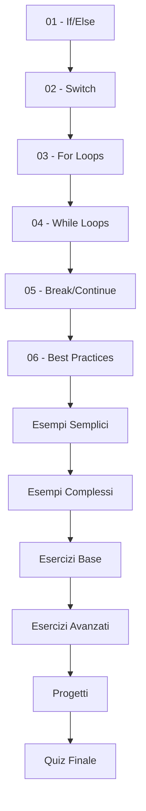

# Modulo D - Istruzioni Decisionali e Iterative 🔄

## 📋 **Informazioni del Modulo**

- **Tempo stimato:** 8-10 ore
- **Difficoltà:** Intermedio
- **Prerequisiti:** Completamento Moduli A, B e C
- **Obiettivo:** Padroneggiare il controllo del flusso con condizioni e cicli

---

## 🎯 **Obiettivi di Apprendimento**

Al termine di questo modulo, sarai in grado di:

- ✅ **Utilizzare** istruzioni condizionali (if, if-else, switch)
- ✅ **Implementare** cicli (for, while, do-while)
- ✅ **Controllare** il flusso con break e continue
- ✅ **Annidare** strutture di controllo complesse
- ✅ **Ottimizzare** algoritmi con cicli efficienti
- ✅ **Gestire** cicli infiniti e condizioni di uscita
- ✅ **Creare** programmi con logica complessa
- ✅ **Validare** input con cicli robusti

---

## 📚 **Contenuti del Modulo**

### **Teoria** 📖
1. **[Istruzioni Condizionali](teoria/01-istruzioni-condizionali.md)** - if, if-else, if-else-if
2. **[Switch Statement](teoria/02-switch-statement.md)** - switch tradizionale e enhanced
3. **[Ciclo For](teoria/03-ciclo-for.md)** - for classico, enhanced for, cicli annidati
4. **[Cicli While e Do-While](teoria/04-cicli-while.md)** - while, do-while, quando usarli
5. **[Controllo Flusso](teoria/05-controllo-flusso.md)** - break, continue, labeled statements
6. **[Pattern e Best Practices](teoria/06-pattern-best-practices.md)** - Tecniche avanzate

### **Esempi Pratici** 💻
- **[CondizioniDemo.java](esempi/CondizioniDemo.java)** - Tutti i tipi di if e switch
- **[CicliDemo.java](esempi/CicliDemo.java)** - for, while, do-while con esempi
- **[MenuInterattivo.java](esempi/MenuInterattivo.java)** - Menu con switch e validazione
- **[GiocoIndovinaNumero.java](esempi/GiocoIndovinaNumero.java)** - Cicli in applicazione reale
- **[PatternComplessi.java](esempi/PatternComplessi.java)** - Cicli annidati e pattern

### **Esercizi** ✏️
- **[Esercizi Progressivi](esercizi/README.md)** - Da semplici if a algoritmi complessi
- **[Soluzioni Complete](esercizi/soluzioni/)** - Soluzioni commentate step-by-step

### **Quiz** 📝
- **[Quiz Modulo D](quiz/quiz-modulo-d.md)** - 18 domande su controllo flusso
- **[Soluzioni Quiz](quiz/soluzioni-quiz-d.md)** - Risposte dettagliate con spiegazioni

### **Progetti** 🎯
- **[Progetto: Sistema di Voti](progetti/sistema-voti/)** - Gestione completa con menu
- **[Progetto: Gioco della Morra](progetti/gioco-morra/)** - Logica di gioco complessa
- **[Progetto: Generatore Pattern](progetti/generatore-pattern/)** - Cicli artistici

---

## 🗂️ **Percorso di Studio Consigliato**



### **Modalità Intensiva Pratica:**
1. **📖 Teoria condizioni** (45 min) - if, switch
2. **💻 Esempi condizioni** (45 min) - CondizioniDemo, MenuInterattivo
3. **📖 Teoria cicli** (60 min) - for, while, do-while
4. **💻 Esempi cicli** (60 min) - CicliDemo, pattern semplici
5. **✏️ Esercizi base** (90 min) - Condizioni e cicli separati
6. **✏️ Esercizi avanzati** (120 min) - Combinazioni complesse
7. **🎯 Progetto pratico** (120 min) - Applicazione completa
8. **📝 Quiz e review** (30 min)

---

## 🛠️ **Strutture di Controllo Fondamentali**

### **1. Istruzioni Condizionali**
```java
// If semplice
if (eta >= 18) {
    System.out.println("Maggiorenne");
}

// If-else
if (voto >= 60) {
    System.out.println("Promosso");
} else {
    System.out.println("Bocciato");
}

// If-else-if
if (voto >= 90) {
    System.out.println("Eccellente");
} else if (voto >= 80) {
    System.out.println("Buono");
} else if (voto >= 60) {
    System.out.println("Sufficiente");
} else {
    System.out.println("Insufficiente");
}
```

### **2. Switch Statement**
```java
// Switch tradizionale
switch (giorno) {
    case 1:
        System.out.println("Lunedì");
        break;
    case 2:
        System.out.println("Martedì");
        break;
    default:
        System.out.println("Giorno non valido");
}

// Switch con multiple labels (Java 14+)
switch (giorno) {
    case 1, 2, 3, 4, 5 -> System.out.println("Giorno feriale");
    case 6, 7 -> System.out.println("Weekend");
    default -> System.out.println("Errore");
}
```

### **3. Cicli**
```java
// For classico
for (int i = 0; i < 10; i++) {
    System.out.println("Iterazione: " + i);
}

// Enhanced for (for-each)
int[] numeri = {1, 2, 3, 4, 5};
for (int numero : numeri) {
    System.out.println(numero);
}

// While
int contatore = 0;
while (contatore < 5) {
    System.out.println(contatore);
    contatore++;
}

// Do-while
int numero;
do {
    numero = scanner.nextInt();
} while (numero < 0);
```

---

## 📊 **Tabelle di Riferimento**

### **Quando Usare Ogni Struttura**
| Struttura | Quando Usare | Esempio Tipico |
|-----------|--------------|----------------|
| `if` | Decisione semplice | Validazione input |
| `if-else` | Scelta binaria | Maggiorenne/minorenne |
| `if-else-if` | Scelte multiple ordinate | Valutazione voti |
| `switch` | Scelte multiple discrete | Menu navigazione |
| `for` | Numero iterazioni noto | Processare array |
| `while` | Condizione all'inizio | Input validation |
| `do-while` | Almeno una iterazione | Menu utente |

### **Operatori per Condizioni**
| Operatore | Significato | Esempio | Risultato |
|-----------|-------------|---------|-----------|
| `==` | Uguale | `5 == 5` | `true` |
| `!=` | Diverso | `5 != 3` | `true` |
| `<` | Minore | `3 < 5` | `true` |
| `<=` | Minore o uguale | `5 <= 5` | `true` |
| `>` | Maggiore | `7 > 3` | `true` |
| `>=` | Maggiore o uguale | `5 >= 7` | `false` |
| `&&` | AND logico | `true && false` | `false` |
| `\|\|` | OR logico | `true \|\| false` | `true` |
| `!` | NOT logico | `!true` | `false` |

---

## ⚠️ **Errori Comuni e Soluzioni**

### **Errore 1: Assegnazione invece di confronto**
```java
// ❌ Problema
if (x = 5) { // Assegnazione, non confronto!
    // Errore di compilazione
}

// ✅ Soluzione
if (x == 5) { // Confronto corretto
    System.out.println("x vale 5");
}
```

### **Errore 2: Dimenticare break in switch**
```java
// ❌ Problema
switch (voto) {
    case 'A':
        System.out.println("Eccellente");
        // Manca break! Continua al case successivo
    case 'B':
        System.out.println("Buono");
        break;
}

// ✅ Soluzione
switch (voto) {
    case 'A':
        System.out.println("Eccellente");
        break; // Break esplicito
    case 'B':
        System.out.println("Buono");
        break;
}
```

### **Errore 3: Ciclo infinito**
```java
// ❌ Problema
int i = 0;
while (i < 10) {
    System.out.println(i);
    // Manca incremento! Ciclo infinito
}

// ✅ Soluzione
int i = 0;
while (i < 10) {
    System.out.println(i);
    i++; // Incremento necessario
}
```

### **Errore 4: Off-by-one errors**
```java
// ❌ Problema
for (int i = 1; i <= array.length; i++) {
    System.out.println(array[i]); // IndexOutOfBoundsException!
}

// ✅ Soluzione
for (int i = 0; i < array.length; i++) {
    System.out.println(array[i]); // Indici corretti
}
```

---

## 💡 **Pattern e Tecniche Avanzate**

### **1. Validazione Input Robusta**
```java
public static int leggiInteroInRange(Scanner scanner, int min, int max) {
    int valore;
    do {
        System.out.printf("Inserisci un numero tra %d e %d: ", min, max);
        while (!scanner.hasNextInt()) {
            System.out.print("Errore! Inserisci un numero: ");
            scanner.nextLine();
        }
        valore = scanner.nextInt();
        scanner.nextLine();
        
        if (valore < min || valore > max) {
            System.out.printf("Errore! Il numero deve essere tra %d e %d%n", min, max);
        }
    } while (valore < min || valore > max);
    
    return valore;
}
```

### **2. Menu con Switch Enhanced**
```java
public static void gestisciMenu() {
    Scanner scanner = new Scanner(System.in);
    boolean continua = true;
    
    while (continua) {
        mostraMenu();
        int scelta = leggiIntero(scanner);
        
        switch (scelta) {
            case 1 -> aggiungiElemento();
            case 2 -> rimuoviElemento();
            case 3 -> visualizzaElementi();
            case 4 -> {
                System.out.println("Arrivederci!");
                continua = false;
            }
            default -> System.out.println("Scelta non valida!");
        }
    }
}
```

### **3. Cicli Annidati per Pattern**
```java
public static void stampaPiramide(int altezza) {
    for (int riga = 1; riga <= altezza; riga++) {
        // Stampa spazi
        for (int spazio = 1; spazio <= altezza - riga; spazio++) {
            System.out.print(" ");
        }
        // Stampa asterischi
        for (int asterisco = 1; asterisco <= 2 * riga - 1; asterisco++) {
            System.out.print("*");
        }
        System.out.println();
    }
}
```

---

## 📊 **Checklist di Autovalutazione**

Prima di procedere al Modulo E, assicurati di saper:

### **Istruzioni Condizionali** 🤔
- [ ] Scrivere condizioni if-else annidate correttamente
- [ ] Utilizzare operatori logici (&&, ||, !) appropriatamente
- [ ] Implementare switch statement con e senza break
- [ ] Scegliere tra if-else e switch in base al contesto

### **Cicli** 🔄
- [ ] Implementare for loop per iterazioni con contatore
- [ ] Utilizzare enhanced for per collezioni e array
- [ ] Scrivere while loop con condizioni corrette
- [ ] Usare do-while quando serve almeno una iterazione

### **Controllo Flusso** 🎯
- [ ] Utilizzare break per uscire da cicli e switch
- [ ] Applicare continue per saltare iterazioni
- [ ] Evitare cicli infiniti con condizioni corrette
- [ ] Gestire labeled break e continue (casi avanzati)

### **Pattern Complessi** 🧩
- [ ] Annidare cicli per problemi bidimensionali
- [ ] Combinare condizioni e cicli efficacemente
- [ ] Validare input con cicli robusti
- [ ] Ottimizzare algoritmi riducendo complessità

### **Debugging e Testing** 🔍
- [ ] Identificare e correggere off-by-one errors
- [ ] Tracciare l'esecuzione di cicli complessi
- [ ] Testare casi limite (array vuoti, input estremi)
- [ ] Usare print statements per debugging

---

## 🎮 **Progetti Pratici Avanzati**

### **Progetto 1: Simulatore ATM** 🏧
- Menu principale con operazioni
- Validazione PIN con tentativi limitati
- Gestione saldo e transazioni
- Log delle operazioni

### **Progetto 2: Gioco Tris** ⭕
- Griglia 3x3 con cicli annidati
- Turni alternati giocatori
- Controllo vittoria in tutte le direzioni
- Richiesta di nuova partita

### **Progetto 3: Analizzatore Testo** 📝
- Lettura testo con cicli
- Conteggio caratteri, parole, righe
- Statistiche dettagliate
- Menu con diverse analisi

---

## 🔗 **Risorse Aggiuntive**

- **[Control Flow Statements](https://docs.oracle.com/javase/tutorial/java/nutsandbolts/flow.html)** - Oracle Tutorial
- **[Switch Expressions](https://openjdk.java.net/jeps/361)** - Java 14+ Features
- **[Loop Optimization](https://wiki.c2.com/?LoopOptimization)** - Tecniche di ottimizzazione
- **[Code Complexity](https://en.wikipedia.org/wiki/Cyclomatic_complexity)** - Complessità ciclomatica

---

## 🚀 **Navigazione del Corso**

- **[📑 Indice Principale](../README.md)**
- **[⬅️ Modulo C - Dati, Assegnazione e I/O](../C-Dati_assegnazione_IO/README.md)**
- **[➡️ Modulo E - Funzioni e Metodi](../E-Funzioni_e_metodi/README.md)**

---

## 📈 **Progressione della Complessità**

```
Livello 1: If semplici e switch base
    ↓
Livello 2: If-else annidati e for loop
    ↓
Livello 3: While loop e validazione input
    ↓
Livello 4: Cicli annidati e pattern complessi
    ↓
Livello 5: Algoritmi con controllo flusso avanzato
```

---

*💡 **Ricorda:** Il controllo del flusso è il cuore della logica di programmazione. Padroneggiare questi concetti ti permette di risolvere problemi di qualsiasi complessità!*
